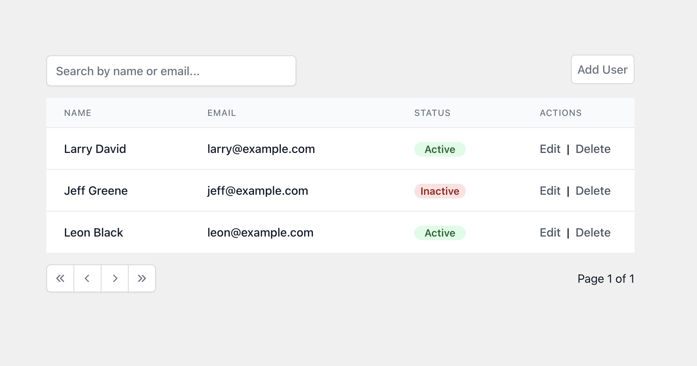
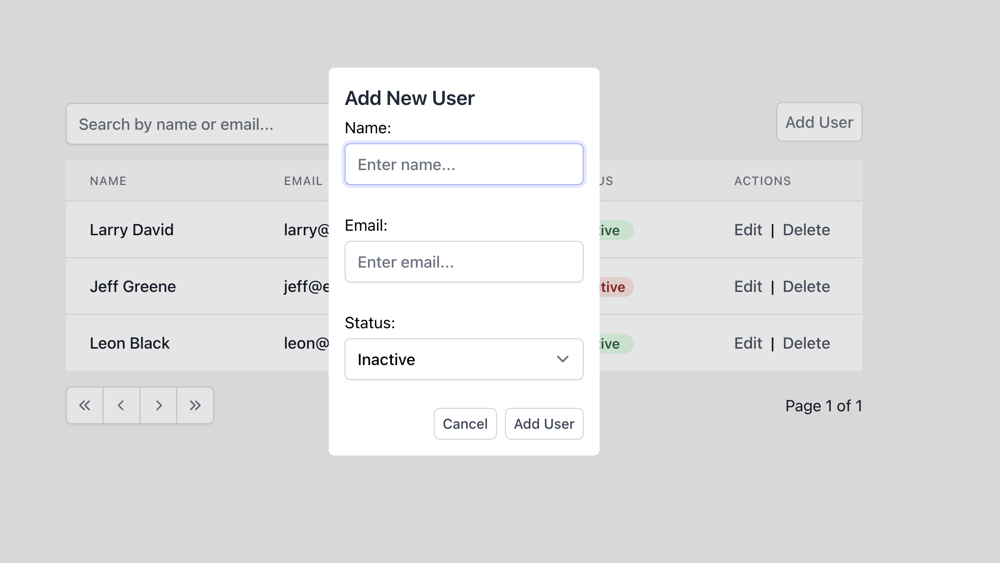
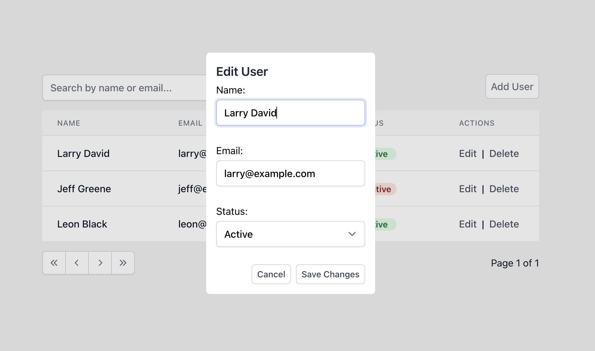
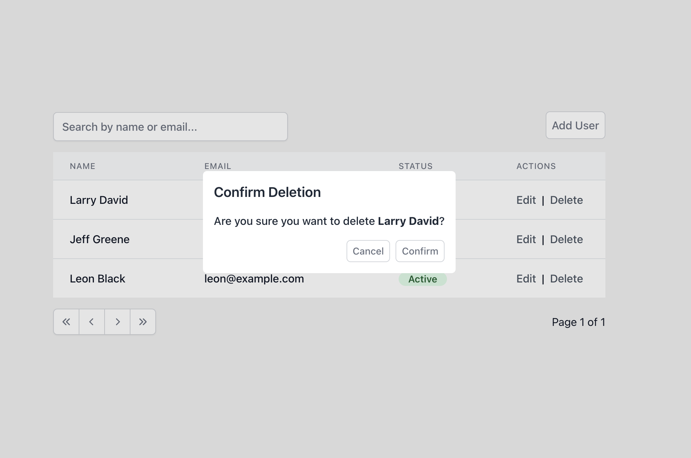

# Full Stack Engineer Take Home Assignment

Thanks for taking the time to review the assignment! The goal is to build a simple web application that allows an admin to manage a network of agents.

## Features

The core features include:
- Displaying a list of agents
- ability to create new agents
- ability to edit existing agents
- ability to delte an agent

I used the following libraries to help:
- React
- Typescript
- Tailwind CSS
- Hero Icons
- Tanstack React Table

Tanstack React Table is used for the data table.  It helped implement a features including searching/filtering on the name and email fields, as well as pagination.

Since this is a smaller application, I chose to handle state management with React Context API.  For larger apps, I would use a more robust state management system like Redux, but I didn't have to worry about things like performance issues.

Additional features include:
- Unit tests using Jests
- Search/Filter (on name/email)
- API Integration (using a simple json-server)

## Running the project

1. Install dependencies:   `npm install`

2. Run the json server in the terminal:  `npm run start:api`

3. In a separate terminal, start the app"   `npm start`

4. Navigate to http://localhost:3000/

## Screen Shots

Admin Table

Edit User Modal

Delete User Modal

## Features I'd Add in the Future
- Sort 
- Filter by status
- Agent Details Page
- Maybe debounce text input during search
- Fuzzy search?
- Responsive design

## Available Scripts

In the project directory, you can run:

### `npm run start:api`

Runs the json server

### `npm start`

Runs the app in the development mode.\
Open [http://localhost:3000](http://localhost:3000) to view it in the browser.

The page will reload if you make edits.\
You will also see any lint errors in the console.

### `npm test`

Launches the test runner in the interactive watch mode.\
See the section about [running tests](https://facebook.github.io/create-react-app/docs/running-tests) for more information.

### `npm run build`

Builds the app for production to the `build` folder.\
It correctly bundles React in production mode and optimizes the build for the best performance.

The build is minified and the filenames include the hashes.\
Your app is ready to be deployed!

See the section about [deployment](https://facebook.github.io/create-react-app/docs/deployment) for more information.

